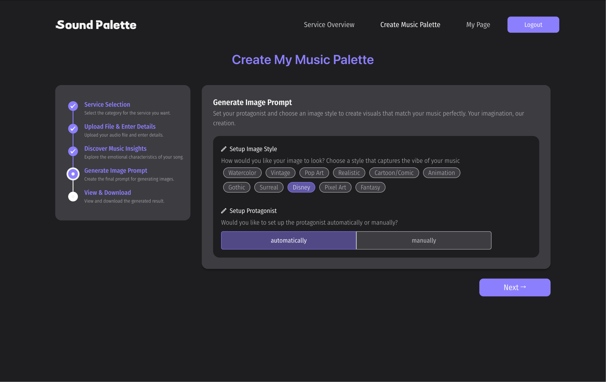

# 당신의 음악에 맞는 이미지를 AI로 완성, SoundPalette

SoundPalette는 음악 홍보 과정에서 커버 이미지 제작이 필요한 아티스트를 위한 솔루션입니다. AI 기술을 활용해 음악의 분위기와 감정에 어울리는 커버 이미지를 쉽고 빠르게 생성할 수 있도록 지원합니다. 🎨🎵


## 🔎 서비스 개발 배경

현대 음악 시장에서는 음악을 표현하는 비주얼 아트가 음악 홍보에 필수적인 요소로 자리 잡았습니다. 많은 사람들이 스트리밍 서비스를 통해 음악을 소비하며, 유튜브나 음악 스트리밍 서비스와 같은 플랫폼에서는 사용자가 음악을 클릭하기 전에 앨범 커버 이미지가 가장 먼저 소개됩니다. 이는 청취자가 음악을 선택하고 경험하는 데 있어 시각적 요소가 중요한 역할을 한다는 것을 보여줍니다.


## ⚠️ 문제 & 솔루션

### SoundPalette가 해결할 문제

```csharp
 개인 아티스트들의 음원 발매, 홍보 과정에서 자본 부족으로 인해 음악과 어울리는 비주얼 아트를 제작하는 데 겪는 어려움
```

### SoundPalette가 제시하는 솔루션

<aside>
  
✅ SoundPalette는 <strong>[음악 입력 → 감정 분석 → 이미지 생성]</strong>의 간단한 과정을 통해, 음악과 완벽히 어울리는 맞춤형 커버 이미지를 빠르고 손쉽게 제공합니다.

</aside>

`1️⃣ 음악 입력`

이미지 생성에 활용할 노래의 오디오 파일, 가사만을 사용자에게 입력 받습니다.

`2️⃣ 음악 감정 분석`

Russell 모델 기반 Valence-Arousal (VA-SPACE) 좌표에서 연속적인 감정 값을 표현하는 Dimensional approach를 활용해 오디오 감정 분석을 진행합니다.
MFCCs를 사용하여 오디오 신호의 주요 특성 추출하고, 이를 통해 감정 값을 예측합니다. HuggingFace의 roberta-base-go_emotions 모델을 사용하여 주어진 가사를 28가지 감정으로 분류합니다.

`3️⃣ 이미지 생성`

gpt-3.5-turbo 모델을 활용해 음악의 내용과 어울리는 주인공의 외모, 성격, 표정 등 세부적인 특징을 생성합니다. 생성된 주인공 특징, 분석된 감정 데이터를 활용하여, gpt-3.5-turbo 모델이 이미지 생성에 적합한 프롬프트를 자동으로 작성 하고, DALL-E 3 모델을 활용하여 프롬프트 기반 이미지 생성을 수행합니다.

## ✔️ 서비스 핵심기능 및 소개

| 웹 화면                                 | 기능                                                                                                                                                                                                                                                                                                     |
| --------------------------------------- | -------------------------------------------------------------------------------------------------------------------------------------------------------------------------------------------------------------------------------------------------------------------------------------------------------- |
|     | **홈/소셜로그인** 사용자는 카카오 소셜 계정을 이용하여 소셜 로그인을 수행하고, 로그인 완료 시, 이미지 생성, 마이페이지 기능을 이용할 수 있습니다.                                                                                                                                                        |
|    | **서비스선택** <br/> 사용자는 음악 커버 단일 이미지 생성과 구간별 이미지 생성 서비스 중 원하는 유형을 선택합니다. (복수 선택 가능)                                                                                                                                                                       |
|    | **오디오 파일 업로드 및 세부사항 입력** <br/> 사용자는 이미지를 생성할 노래 제목, 오디오파일, 가사를 입력합니다.                                                                                                                                                                                         |
|       | **STT를 통해 자동 추출한 노래 구간별 가사 확인** <br/> 구간별 이미지 생성 서비스를 선택한 사용자는 STT로 자동 추출한 각 구간의 가사를 확인하고, 필요한 경우 수정합니다.                                                                                                                                  |
|  | **음악 분석 결과 확인** <br/> GPT를 통해 노래 테마와 가사 요약 내용을 반영한 곡 소개를 확인하고, 멜로디 감정 분석 결과, 가사 감정 분석 결과 확인합니다.                                                                                                                                                  |
|  | **음악 분석 결과 확인** <br/> GPT를 통해 노래 테마와 가사 요약 내용을 반영한 곡 소개를 확인하고, 멜로디 감정 분석 결과, 가사 감정 분석 결과 확인합니다.                                                                                                                                                  |
|    | **이미지 프롬프트 생성**<br/> 원하는 이미지 스타일 옵션을 선택하고, 주인공 설정 옵션을 선택합니다. 자동 버튼을 클릭하면, 노래에 어울리는 주인공의 나이, 성별, 외형 및 세부 정보가 자동으로 설정됩니다. 수동 버튼을 클릭하면 주인공 설정 템플릿이 제공되며, 원하는 주인공 정보를 직접 입력할 수 있습니다. |
|    | **이미지 생성 결과 확인**<br/> 노래를 재생해 생성된 이미지가 음악과 어울리는지 확인합니다. 다운로드 버튼을 클릭해 이미지를 다운로드 받을 수 있습니다.                                                                                                                                                    |

## 🛠️ Stacks

 
   
     
     
     
     
     
 

**`React`**

- React는 가장 핵심 요소인 Virtual Dom을 이용하여 불필요한 화면 갱신을 최소화합니다. 이를 통해, 성능 향상을 시킬 수 있으며 빠른 렌더링을 지원합니다.
- React의 생태계는 비교적 방대하며, 개발자 커뮤니티도 활발합니다. 그만큼 다양한 라이브러리, 플러그인 등이 개발되어 있어 생산성을 향상시킬 수 있습니다.
- React는 컴포넌트 기반 아키텍처를 채택하고 있으며, UI 요소들을 컴포넌트로 분리하여 개발하고 조합하는 방식으로 구성할 수 있습니다. 따라서, 컴포넌트의 재사용성을 용이하게 하며, 코드 수정 및 유지보수에 효율적입니다.

**`Typescript`**

- Typescript는 Javascript 기반의 정적 타입 문법을 추가한 언어로, 타입 추가로 인해 안정적인 개발과 높은 수준의 코드 품질을 유지할 수 있습니다.
- 컴파일 과정에서 타입을 지정하기 때문에 컴파일 에러 예방, 손쉬운 디버깅이 가능해집니다.
- 변수, 함수, 매개변수, 함수 반환 값 등 타입 어노테이션(type annotation)을 추가할 수 있으며, 이를 통해 개발자가 코드의 의도를 명확하게 표현할 수 있습니다. 따라서 다른 개발자들이 코드를 이해하기 쉽게 도와줄 수 있습니다.

**`TailwindCSS`**

- TailwindCSS는 유틸리티 클래스 기반 스타일링을 통해 빠르고 직관적인 UI 개발을 지원합니다.
- 전역 스타일 충돌을 방지하고, 미리 정의된 클래스 사용으로 일관성 있는 디자인 시스템을 구축할 수 있습니다.
- 커스터마이징 가능한 설정 파일로 프로젝트에 맞는 디자인을 쉽게 적용할 수 있습니다.

**`Styled Components`**

- Styled Components는 CSS를 Javascript로 작성된 컴포넌트에 바로 삽입하는 기법으로, 컴포넌트 스타일링을 쉽게 구현할 수 있습니다. 뿐만 아니라, Javascript의 기능을 활용하여 동적인 스타일을 생성하거나 조건부 스타일을 적용할 수 있습니다.
- CSS를 컴포넌트 기반으로 스타일링함으로써 컴포넌트 단위로 스타일을 정의하고 관리할 수 있습니다. 따라서, 컴포넌트 지향적인 스타일링이 가능하하며, 전역 스타일 충돌을 방지할 수 있습니다.

**`Axios`**

- 크로스 브라우징 최적화로 브라우저 호환성이 뛰어나며, Javascript 내장 라이브러리인 fetch와 다르게 오래된 브라우저 지원 불가에 대한 걱정이 필요하지 않습니다.
- Promise 기반으로 만들어졌기 때문에 데이터를 다루기 편리합니다. 뿐만 아니라, 많은 기능을 제공하고 있어 요청과 응답을 보다 쉽게 다룰 수 있는 편의성을 제공합니다.

**`React Query`**

- 비동기 데이터를 효율적으로 관리하고, 데이터 캐싱 및 동기화를 지원합니다.
- 서버 상태 관리를 간소화하여 API 데이터 처리 로직을 깔끔하게 유지할 수 있습니다.
- 자동 재요청, 데이터 stale-time 설정 등을 통해 성능 최적화를 지원합니다.

**`Zustand`**

- 경량 상태관리 라이브러리로, 간단하고 직관적인 API를 제공합니다.
- React의 context 사용을 최소화하며, 구독 기반의 상태 업데이트를 지원해 불필요한 리렌더링을 줄입니다.
- 전역 상태를 손쉽게 관리하면서도 유지보수성을 높이는 데 유용합니다.

**`Vite`**

- Vite는 개발 서버가 빠르게 번들링하고 HMR(Hot Module Replacement, 앱을 종료하지 않고 갱신된 파일만 교체하는 방식)을 지원함으로써 빠른 개발 속도를 제공합니다.
- Vite의 사전 번들링 기능은 ESbuild를 사용하고 있어 기존 번들러 대비 10~100배 빠른 번들링 속도를 가지고 있습니다.

**`Vercel`**

- Vercel은 빠르고 간편한 배포 환경을 제공하며, CI/CD 워크플로를 자동화합니다.
- 글로벌 CDN을 통해 최적화된 성능과 낮은 응답 시간을 보장합니다.
- 서버리스 함수와 정적 콘텐츠 배포를 손쉽게 지원해 개발과 배포 속도를 동시에 높입니다.

## Information Architecture


## 🌐 System Architecture


